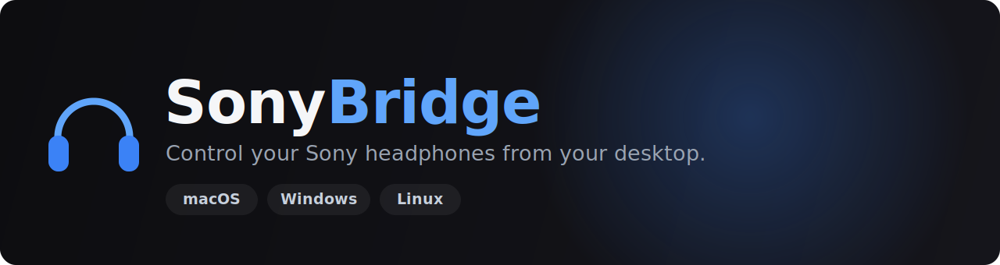
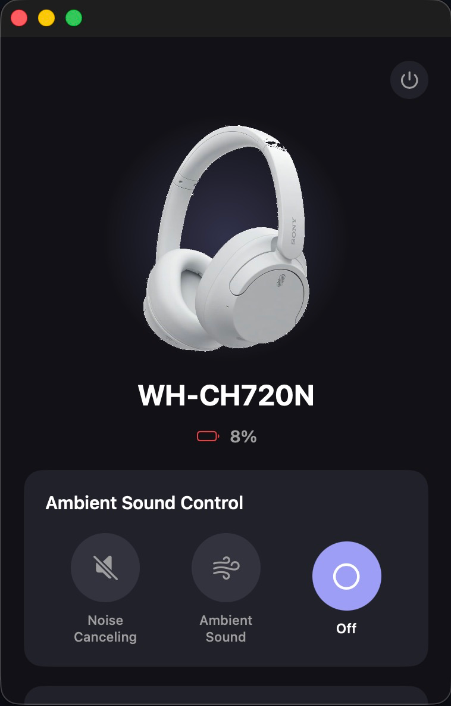
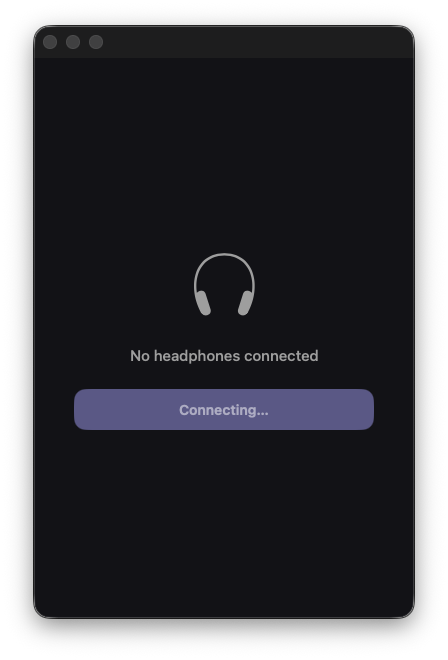

<div align="center">



<br/>

**An unofficial, open-source desktop app for Sony headphones — Noise Cancelling, Ambient Sound, EQ, DSEE and battery, without the phone.**

<br/>

[](https://github.com/AmitRajput-Dev/SonyBridge/actions/workflows/cmake.yml)
[](https://github.com/AmitRajput-Dev/SonyBridge/releases)
[](https://github.com/AmitRajput-Dev/SonyBridge/releases)
[](https://github.com/AmitRajput-Dev/SonyBridge/stargazers)
[](LICENSE)


<br/>

[](https://github.com/AmitRajput-Dev/SonyBridge/releases/latest)
[](https://github.com/AmitRajput-Dev/SonyBridge/releases/tag/v0.4.0-beta1)
[](https://github.com/sponsors/AmitRajput-Dev)
[](https://www.buymeacoffee.com/amitrajput)

<br/>

**[Features](#-features)** · **[Download](#-download)** · **[How it works](#-how-it-works)** · **[Contributing](#-contributing)** · **[Credits](#-credits)**

<br/>


&nbsp;&nbsp;


</div>

---

## Why

Sony locks headphone settings behind their mobile-only *Sound Connect* app. If you live on a laptop,
you're stuck. SonyBridge talks to the headphones directly over Bluetooth RFCOMM using Sony's
reverse-engineered binary protocol — no phone required.

The original [SonyHeadphonesClient](https://github.com/Plutoberth/SonyHeadphonesClient) only spoke Sony's
**first-generation** protocol, so newer headsets (WH-CH720N, XM4/XM5, WF-series, LinkBuds…) just timed
out on connect. SonyBridge adds full **second-generation ("v2") protocol** support, a native SwiftUI app
on macOS, and a matching modern UI on Windows/Linux.

## ✨ Features

- 🎚️ **Ambient Sound Control** — Noise Cancelling · Ambient Sound (0–20 levels) · Off
- 🗣️ **Focus on Voice** passthrough
- 🎛️ **Equalizer** — presets *and* a full **Manual mode** with 5 bands + Clear Bass
- ✨ **DSEE** — Sony's audio upscaling for compressed sources
- 🔋 **Battery level** — live percentage, including **per-earbud + case** for TWS models
- 🎧 **Codec & firmware** readout
- 🧩 **Capability-gated extras** — Auto Power-Off · Speak-to-Chat · Adaptive Volume (only shown when your device supports them)
- 🖼️ **Device hero image** — your headphones' official Sony product render
- 🔄 **Live button sync** — changes made on the headset reflect in the app
- 🔌 **Auto-connect** to your already-paired Sony headset
- 🧬 **Dual-protocol** — auto-detects and speaks either protocol generation
- 🌑 **Modern UI** — dark, minimal, shaped after Sony's own app (SwiftUI on macOS, Dear ImGui on Windows/Linux)

## 📥 Download

<table>
<tr>
<th>Platform</th><th>Get it</th><th>Notes</th>
</tr>
<tr>
<td><b>macOS</b></td>
<td>

`brew tap AmitRajput-Dev/tap && brew install --cask sonybridge`

or [**Download .app**](https://github.com/AmitRajput-Dev/SonyBridge/releases/latest)

</td>
<td>macOS 11+ · Apple Silicon &amp; Intel</td>
</tr>
<tr>
<td><b>Windows</b></td>
<td>

[**Download Beta**](https://github.com/AmitRajput-Dev/SonyBridge/releases/tag/v0.4.0-beta1)

</td>
<td>🧪 Beta — testers wanted</td>
</tr>
<tr>
<td><b>Linux</b></td>
<td>

[Build from source](#-build-from-source)

</td>
<td>GLFW/OpenGL build</td>
</tr>
</table>

> 💡 After launching, **connect your headphones in your OS Bluetooth settings first**, then open SonyBridge and hit *Connect*. Keep audio playing — Sony headsets drop the control link when idle to save power.

<details>
<summary><b>macOS install notes (Gatekeeper)</b></summary>

The app is ad-hoc signed (not notarized — no paid Apple Developer account). The Homebrew cask clears the
quarantine flag for you. For a direct download, allow it once:

```sh
xattr -dr com.apple.quarantine /Applications/SonyBridge.app
```

…or right-click the app → **Open** → **Open**. Homebrew also asks you to trust the third-party tap the
first time (`brew trust AmitRajput-Dev/tap`).
</details>

## 🎧 Supported headphones

| Status | Devices |
|--------|---------|
| ✅ **Verified** | WH-CH720N, Sony ULT WEAR (WH-ULT900N) |
| 🟢 **Expected** (v2, over-ear — NC/Ambient/battery/EQ) | WH-1000XM5, WH-1000XM6, WH-XB910N, WH-CH520 |
| 🟡 **v2 earbuds** (controls work; battery format differs) | WF-1000XM4, WF-1000XM5, WF-C700N, LinkBuds S |
| 🔵 **Legacy** (v1 protocol — NC/Ambient only) | WH-1000XM4, WH-1000XM3, WH-1000XM2, WH-XB900N, MDR-XB950BT |

> Only the WH-CH720N is fully hardware-verified. Others share the same protocol family, so the basics
> should work — per-model quirks are untested. Reports and PRs for other devices are very welcome.

## 🚀 Build from source

<details>
<summary><b>macOS (native SwiftUI app)</b></summary>

Requires **Xcode 14+**.

```sh
git clone --recurse-submodules https://github.com/AmitRajput-Dev/SonyBridge.git
open SonyBridge/Client/macos/SonyHeadphonesClient.xcodeproj
```

Then ⌘R.
</details>

<details>
<summary><b>Windows / Linux (Dear ImGui UI)</b></summary>

**Windows** (CMake + MSVC, from a Developer Command Prompt):
```sh
cd Client && mkdir build && cd build
cmake .. && cmake --build . --config Release
```

**Linux** (`sudo apt install libbluetooth-dev libglfw3-dev libdbus-1-dev`):
```sh
cd Client && mkdir build && cd build
cmake .. && cmake --build .
```

Keep the built binary next to its `resources/` folder (device hero images load from `resources/devices/`).
</details>

## 🔬 How it works

Sony headphones expose a vendor RFCOMM/SPP service. Commands are framed as:

```
<START 0x3e> ESCAPE( <TYPE> <SEQ> <4-byte BE length> <PAYLOAD> <checksum> ) <END 0x3c>
```

Two protocol generations exist, distinguished by their SDP service UUID:

- **v1** — `96CC203E-…` — WH-1000XM3 and older
- **v2** — `956C7B26-…` — WH-CH720N, Sony ULT WEAR, XM4/XM5, WF-series, LinkBuds…

SonyBridge tries v1 first, falls back to v2, and remembers which succeeded. The v2 path adds the mandatory
init handshake and per-frame host-ACK the newer devices require, plus battery, EQ and DSEE inquiry commands.
Protocol byte layouts were cross-referenced against
[**GadgetBridge**](https://codeberg.org/Freeyourgadget/Gadgetbridge)'s Sony implementation.

## 🤝 Contributing

Contributions are very welcome — especially **device reports** and **testing on real hardware**.

- 🐛 **Found a bug / have a device to report?** [Open an issue](https://github.com/AmitRajput-Dev/SonyBridge/issues/new) with your model and what happened.
- 🧪 **Want to test?** Grab a [release](https://github.com/AmitRajput-Dev/SonyBridge/releases) and tell us how it behaves on your headset (a screenshot helps a lot).
- 🔧 **Code?** Fork, branch, and open a PR against `main`. CI builds macOS, Windows and Linux on every PR.

## 🙏 Credits

SonyBridge builds directly on the work of:

- [**SonyHeadphonesClient**](https://github.com/Plutoberth/SonyHeadphonesClient) by Plutoberth, Mr-M33533K5 &amp; contributors — the original cross-platform client and protocol foundation
- [**semvis123**](https://github.com/semvis123) — the original macOS port
- [**GadgetBridge**](https://codeberg.org/Freeyourgadget/Gadgetbridge) — reverse-engineered v2 protocol reference

**Community contributors & testers:**

- [**@CrisProCrack**](https://github.com/CrisProCrack) — WH-1000XM4 (v1) connect fix
- [**@Sebsdnl**](https://github.com/Sebsdnl) — Linux/Wayland crash fix &amp; ULT WEAR support
- **u/More_Way_6784**, **@joelslaby** — WH-1000XM4 hardware testing

## ❤️ Support

If SonyBridge is useful to you, consider [**sponsoring**](https://github.com/sponsors/AmitRajput-Dev) or
[**buying a coffee**](https://www.buymeacoffee.com/amitrajput) — it keeps the reverse-engineering going.
Starring the repo helps too. ⭐

## ⚠️ Disclaimer

This project is **not affiliated with, endorsed by, or connected to Sony**. It talks to your headphones
using a reverse-engineered protocol, for interoperability. Use at your own risk.

## 📄 License

[MIT](LICENSE) — original copyright retained; see [Credits](#-credits).
